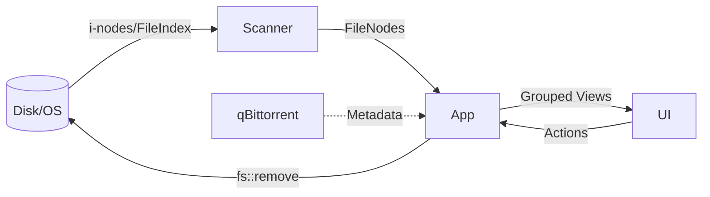

# Architecture Overview

`ratatidy` is a TUI-based media management tool designed to reconcile files between download directories and media libraries, with a focus on preserving and identifying hardlinks.

## System Architecture

The application follows a **Single Source of Truth** model where a master list of physical files is maintained and presented through different filtered and grouped views.

### Key Components

- **Scanner (`scanner.rs`)**: Performs cross-platform directory traversal. It uses OS-specific APIs (Win32 on Windows, MetadataExt on Linux) to identify physical files via Device ID and Inode/File Index.
- **Data Model (`app.rs` / `scanner.rs`)**:
    - `FileNode`: Represents a unique physical file on disk.
    - `Group`: A logical collection of `FileNode` objects (e.g., a Movie folder or a TV show season).
- **Application State (`app.rs`)**: Manages the master list of `FileNode`s, user interface state (tabs, selection, filters), and coordinates deletions.
- **qBittorrent Integration (`qbittorrent.rs`)**: An optional module that fetches torrent metadata to enrich `FileNode` info.
- **User Interface (`ui.rs`)**: A stateless rendering layer built with `ratatui`.

## Core Logic Flow Summary

1. **Initialization**: Config is loaded from CLI, environment, or `.env`. If paths are missing, an interactive prompt guides the user.
2. **Scanning**: The program scans the download and media directories, identifying hardlinked files that share the same physical storage.
3. **Enrichment**: (Optional) Data from qBittorrent is matched against files to identify seeding status and torrent hashes.
4. **Interaction Loop**: The TUI allows users to switch between "Media" and "Downloads" views, search, filter, and perform safe, context-aware deletions.
5. **Execution**: Deletions are processed by updating the master node list, deleting files from disk, and optionally removing torrents from qBittorrent.

> [!TIP]
> For a more exhaustive technical breakdown of internal logic, see the [Flow Analysis](file:///c:/Users/alber/dev/ratatidy/docs/flow_analysis.md) document.

## Data Structure Diagram

