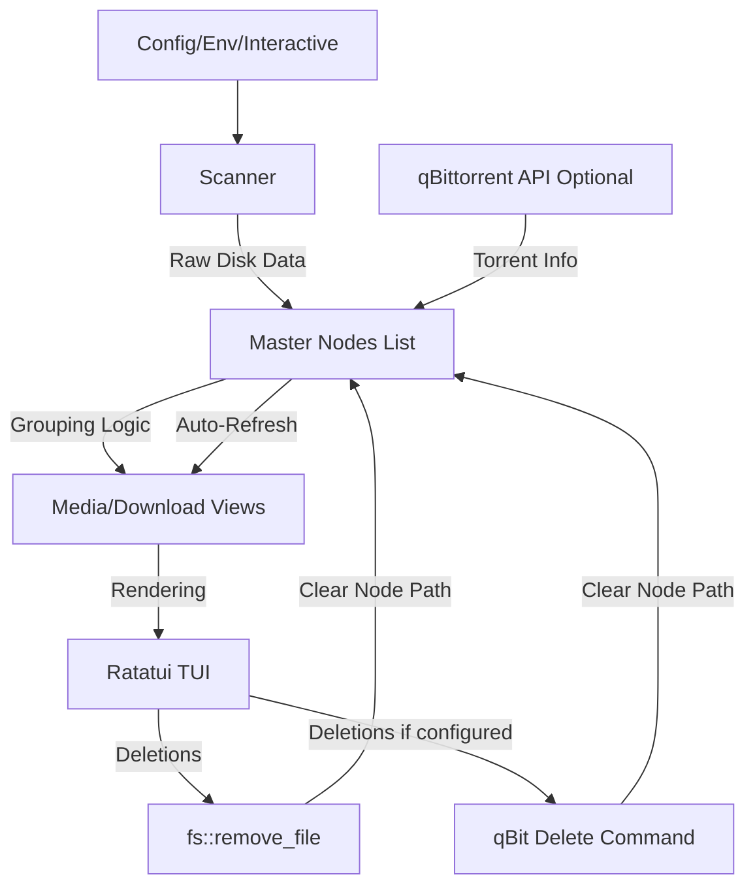

# Architecture Overview - Checkpoint 4 (User Feedback Integration)

`ratatidy` follows a **Single Source of Truth** architecture to ensure data consistency across multiple terminal views (tabs).

## Core Philosophy
1. **Master Node List**: There is only one list of files (`FileNode`).
2. **Derived Views**: Tabs (Media, Downloads) are just different ways of "grouping" the same master list.
3. **Hardware Abstraction**: OS-specific logic (Windows Handles vs. Linux Inodes) is isolated in the `Scanner`.
4. **Optional Integrations**: qBittorrent is optional; if not configured, the tool works as a pure file manager.

## Component Breakdown

### 1. Data Model (`scanner.rs`, `app.rs`)
- **`FileKey`**: A unique identifier for a physical file.
  - Windows: `(VolumeID, FileIndex)` via Win32 API.
  - Linux/Unix: `(DevID, InodeID)` via `std::os::unix::fs`.
- **`FileNode`**: Represents a single physical file (which can have multiple hardlinked paths).
- **`Group`**: A collection of `FileNode`s sharing a logical parent.

### 2. Configuration (`config.rs`)
- **Loading Order**: CLI args > Environment variables > Defaults.
- **Interactive Setup** (Planned): If required paths are missing, prompt user interactively.
- **Optional qBittorrent**: Works without qBit credentials; seeding info and torrent deletion only available when configured.

### 3. State Management (`app.rs`)
- **`App` struct**: The central controller.
  - Holds `nodes: Vec<FileNode>`.
  - **`execute_delete()`**: Modifies master nodes, performs disk deletions, queues qBit deletions (if configured).

### 4. qBittorrent Integration (`qbittorrent.rs`)
- **Trait-based API**: Swap between `RealQbitClient` and `MockQbitClient`.
- **Graceful Fallback**: If credentials missing or connection fails, fall back to offline mode.

### 5. User Interface (`ui.rs`, `tui.rs`)
- **Ratatui**: Stateless rendering approach.
- **POV System**: Switching tabs changes grouping context but shows same underlying file statuses.

## Data Flow

## Performance Considerations (Planned)
- **Async Scanning**: Move disk I/O off the main thread.
- **Progress Indicator**: Show feedback during large scans.
- **Lazy/Cached Loading**: Reduce startup time for multi-TB libraries.
