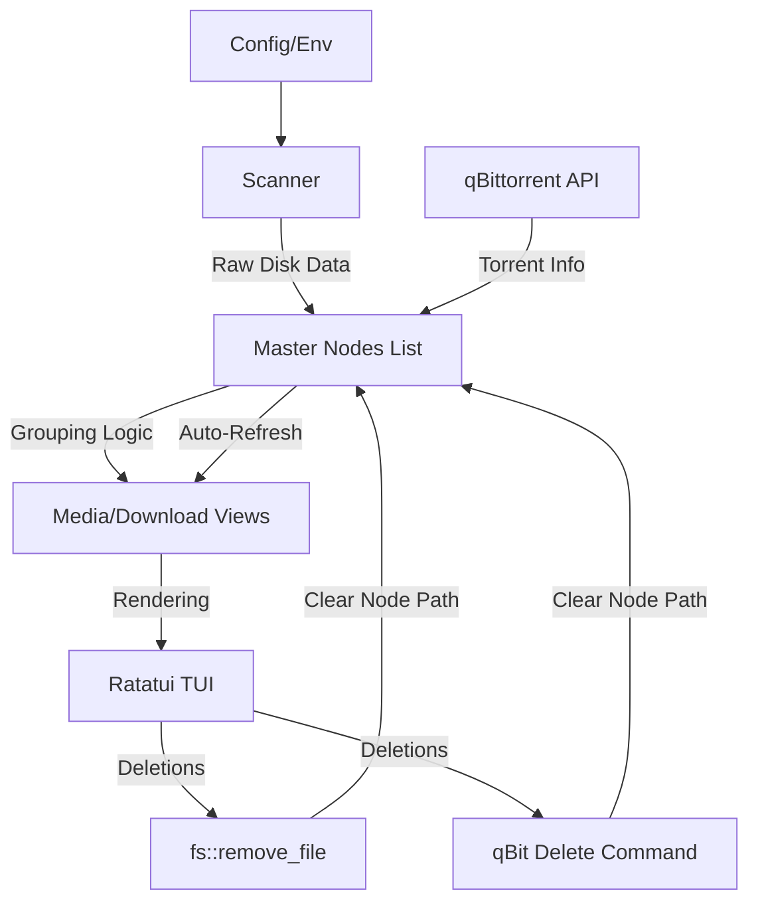

# Architecture Overview - Checkpoint 3 (Production Ready)

`ratatidy` follows a **Single Source of Truth** architecture to ensure data consistency across multiple terminal views (tabs).

## Core Philosophy
1. **Master Node List**: There is only one list of files (`FileNode`).
2. **Derived Views**: Tabs (Media, Downloads) are just different ways of "grouping" the same master list.
3. **Hardware Abstraction**: OS-specific logic (Windows Handles vs. Linux Inodes) is isolated in the `Scanner`.

## Component Breakdown

### 1. Data Model (`scanner.rs`, `app.rs`)
- **`FileKey`**: A unique identifier for a physical file.
  - Windows: `(VolumeID, FileIndex)` via Win32 API.
  - Linux/Unix: `(DevID, InodeID)` via `std::os::unix::fs`.
- **`FileNode`**: Represents a single physical file (which can have multiple hardlinked paths).
  - Tracks if it exists in "Downloads", "Media", or both.
- **`Group`**: A collection of `FileNode`s that share a logical parent (e.g., a movie folder or a torrent).

### 2. State Management (`app.rs`)
- **`App` struct**: The central controller.
  - Holds `nodes: Vec<FileNode>`.
  - Holds `media_groups` and `download_groups` (rebuilt whenever the master list changes).
  - **`execute_delete()`**: Pure logic that modifies the master nodes list, perform disk deletions, and then triggers `refresh_groups()`.

### 3. qBittorrent Integration (`qbittorrent.rs`)
- **Trait-based API**: Allows swapping between `RealQbitClient` (Reqwest) and `MockQbitClient` (Local Testing).
- **Async Queueing**: Deletions are queued in `App` and processed in the main event loop to avoid blocking the TUI thread.

### 4. User Interface (`ui.rs`, `tui.rs`)
- **Ratatui**: Uses a stateless rendering approach.
- **POV System**: Switching tabs changes the "Grouping Context" but reveals the same underlying file statuses (LINKED, ORPHAN, etc.).

## Data Flow

