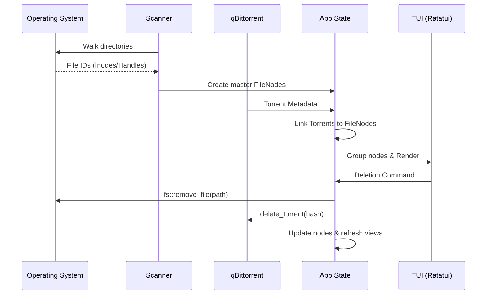

# Ratatidy: Detailed Flow Analysis

This document provides a deep dive into the internal mechanics of `ratatidy`, from initialization to complex deletion workflows.

## 1. Startup and Configuration (`main.rs`, `config.rs`)

When the application starts, it follows a strict initialization sequence:

1.  **Environment Loading**: Uses `dotenvy` to load variables from a `.env` file if present.
2.  **Config Hierarchy**: 
    - First, it tries to load `config.toml` from the OS-specific project directory (e.g., `AppData/Roaming/ratatidy` on Windows).
    - If missing, it parses command-line arguments and environment variables via `clap`.
3.  **Interactive Setup**: If neither config nor arguments provide `download_dir` or `media_dirs`, the program enters an interactive prompt mode (using `rustyline` for path completion) to ask the user for these paths. These are then saved to `config.toml`.
4.  **Integration Setup**: It initializes the qBittorrent client. If no credentials are found, it falls back to a `MockQbitClient` (or a "no-op" client) to avoid crashing.

## 2. The Scanner Phase (`scanner.rs`)

The core of Ratatidy is identifying physical files, even if they appear in multiple locations.

1.  **Recursive Walk**: The scanner traverses the `download_dir` and all `media_dirs`.
2.  **Physical Identity (`FileKey`)**:
    - On **Windows**, it uses `GetFileInformationByHandle` to retrieve the `dwVolumeSerialNumber` and `nFileIndex`. This pair uniquely identifies a file on a volume.
    - On **Linux**, it uses `st_dev` and `st_ino`.
3.  **Deduplication**: As files are found, they are stored in a `HashMap<FileKey, FileNode>`.
    - If a file with the same `FileKey` is found in a second location (e.g., once in downloads and once in media), its path is added to the existing `FileNode`.
    - This allows the app to know that `/media/Movie.mkv` and `/downloads/Movie.mkv` are actually the same physical data.
4.  **Metadata**: The scanner also collects file size and modification times for sorting and display.

## 3. Enrichment and Grouping (`main.rs`, `grouping.rs`)

Once the file system is mapped:

1.  **qBit Matching**: The app fetches the list of active torrents. It uses a heuristic (currently name-based) to link a `FileNode` to a `torrent_hash`. If a match is found, the node is marked as `is_seeding`.
2.  **Logical Grouping**:
    - Users don't manage individual files; they manage "items" (like a movie or a season).
    - **`group_by_media`**: Scans the `media_dirs` and groups files by the first folder depth (e.g., `/media/movies/Avatar/file.mkv` belongs to the group "Avatar").
    - **`group_by_downloads`**: Performs a similar operation for the `download_dir`.
    - These "Groups" are ephemeral views of the master `nodes` list.

## 4. The Interaction Loop (`app.rs`, `ui.rs`)

The application runs a standard "Game Loop" at ~60fps (16ms poll):

1.  **Stateless Rendering**: `ui::render` takes the current `app` state and draws the entire screen.
    - **Tabs**: "POV" (Point of View) switch.
        - **Media (Tab 1)**: Aggregated view of all media folders.
        - **Folder Tabs (Tab 2..N)**: Individual views for each specific media directory (e.g., Movies, TV).
        - **Downloads (Last Tab)**: View of the download directory.
    - **Details Panel**: Shows the exact paths and link status for the selected group.
2.  **Event Handling**: Keypresses mutate the `App` struct.
    - **`Tab`**: Cycles linearly through all available tabs (`Media` -> `Folder 1` -> ... -> `Downloads` -> `Media`).
    - **`1-9`**: Jumps directly to the corresponding tab index.
    - `f`: Cycles `filter` (All -> Orphans -> Hardlinked).
    - `s/S`: Changes `sort_by` and `sort_order`.
3.  **Master Node Filtering**: When you apply a filter, the `App` recalculates which `Groups` contain `FileNode`s matching that filter.

## 5. The Deletion Workflow (`app.rs`)

Deletion is the most critical part of the program. It follows a multi-step safety process:

1.  **Context-Aware Selection**: When you press `d`, the app calculates what *can* be deleted for the selected item:
    - If it only exists in Downloads, only the "Delete from Downloads" option appears.
    - If it exists in both, "Delete from Media", "Delete from Downloads", and "Delete Everywhere" are offered.
2.  **The Purge Flow (`execute_delete`)**:
    - **Physical Deletion**: The app identifies which paths of a `FileNode` match the selected scope.
    - **Disk Action**: It calls `std::fs::remove_file` for those specific paths.
    - **API Action**: If a `torrent_hash` is associated and the scope includes "Downloads", the hash is added to `pending_qbit_deletions`.
3.  **Background Processing**: In the next loop tick, `main.rs` sees the pending hashes and calls the qBittorrent API to delete the torrent and its files.
4.  **State Synchronization**: The master `nodes` list is updated. If a `FileNode` has no paths left, it is removed. The groups are then refreshed to reflect the new state of the disk.

## Summary of Data Flow

